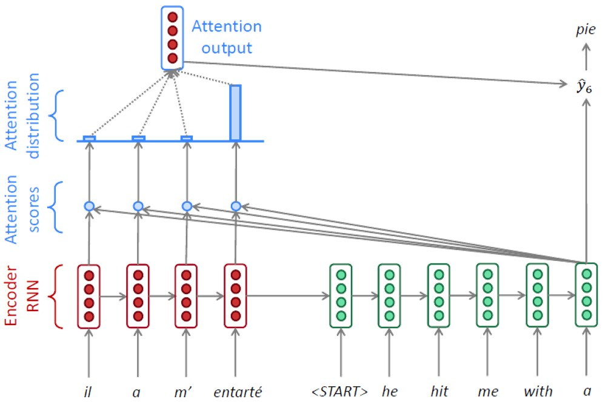
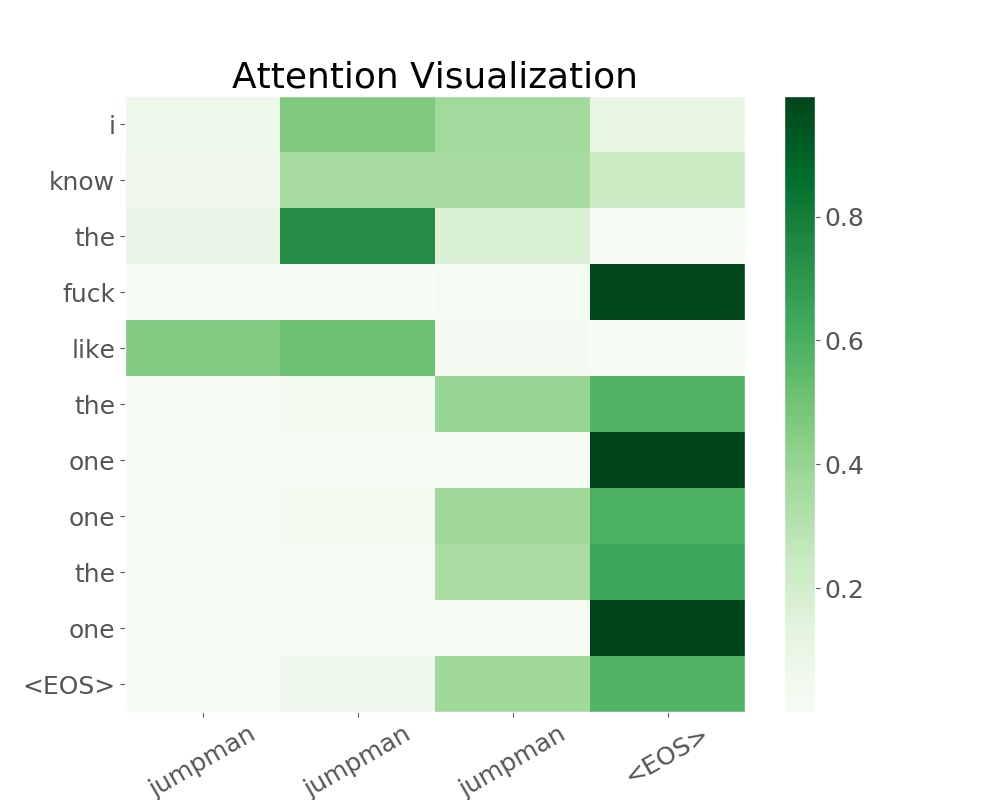
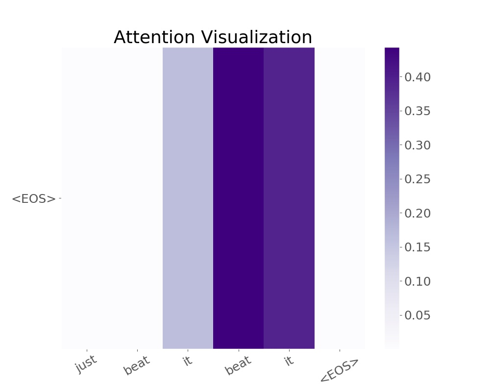

# Lyrics generator using attention mechanism

<!-- vim-markdown-toc GFM -->

* [Introduction](#introduction)
* [Data Preparation](#data-preparation)
    * [1. 'PAD', 'SOS' and 'EOS'](#1-pad-sos-and-eos)
    * [2. Batch Data](#2-batch-data)
    * [3. Pretrained Embedding](#3-pretrained-embedding)
* [Model Structure](#model-structure)
    * [1. Bidirectional GRU Layer](#1-bidirectional-gru-layer)
    * [2. Exploitation and exploration](#2-exploitation-and-exploration)
* [Evaluation and Visualization](#evaluation-and-visualization)
    * [1. Drake's Lyrics Generator](#1-drakes-lyrics-generator)
    * [2. Eminem's Lyrics Generator](#2-eminems-lyrics-generator)
    * [3. Michael Jackson's Lyrics Generator](#3-michael-jacksons-lyrics-generator)
* [Concluding Remarks and Future Work](#concluding-remarks-and-future-work)
* [Reference](#reference)
* [Acknowledgement](#acknowledgement)

<!-- vim-markdown-toc -->
## Introduction

Neural network has capability to process complex data such as human languange, images and etc. This is due to its nonliearity nature. Multilayer Perceptron forms vanilla fully-connected neural network. However, it does not fit on data with sequential order. 

<div align=center></div>

Recurrent network can process sequences as input by utilizing hidden unit in a sequential order. However, RNN with LSTM (or GRU) as basic unit does not hold long term dependencies. It is easy to observe output with repetition pattern from a vanilla RNN.

<div align=center></div>

To resolve the issue, one can resort to attention mechanism. Attention mechanism calculates the importances of words in output and input. Therefore, it is a very efficient way to generate output with different contributions from all input. The concept was first referred and clearly stated from [Attention Is All You Need](https://papers.nips.cc/paper/7181-attention-is-all-you-need.pdf).


In this project, I focused on how to implement attention mechanism into vanilla seq2seq model. (pic from cs224n stanford)

## Data Preparation

Since the lyrics generator is based on word-level language model, we removed all unnecessary punctuations. Note that, it is not necessary to remove punctuations and keeping punctuation will make the output look more fluent. We will add them back to our model in the future.

### 1. 'PAD', 'SOS' and 'EOS'

We added 'PAD', 'SOS', 'EOS' tokens to word2index dictionary. 'PAD' is helpful when sequences come with different lengths. However, processing padded sequences can be expensive as they bring zero information. Fortunately, pytorch provides a decent way to deal with it. We will be using ```pad_packed_sequence, pack_padded_sequence``` while feeding data into the model. SOS and EOS help stop lyrics generation at early time. 

```python
class vocab:
    def __init__(self):
        self.word2index = {}
        self.word2count = {}
        self.index2word = {0: 'PAD', 1: 'SOS', 2: 'EOS'}
        self.n_words = 3  # Count PAD, SOS and EOS
        self.max_length = 1
```

### 2. Batch Data

As the model is quite large, training in a mini-batch fashion could significantly reduce the computation time and acquire more stablized results. Function ```random_batch``` bootraps data with shape max_sequence_length x batch_size x hidden_size.

```python
def random_batch(batch_size, lang, pairs, USE_CUDA=True):
	'''
	input -> batch_size
	return -> input/output of a batch, array of lengths of input/output
	batched data -> max_len x batch_size (note that this is required size feeding to gru layer)
	'''
```

As the model is hard to train, we used pretrained embedding matrix (GloVe from Stanford) to reduce the difficulty of training.

### 3. Pretrained Embedding

```python
def pretrained(glove_path):
    '''
    load pretrained glove and return it as a dictionary
    '''
    # dimension of import word2vec file
    glove = {}
    with open(glove_path,'r') as f:
        for line in f:
            values = line.split()
            word = values[0]
            coefs = np.asarray(values[1:], dtype='float32')
            glove[word] = coefs
    return glove
```

As a singer can only have 500 songs at most in her/his career, it means the dataset is small if we train our model for individuals. Training model for a particular music genre makes more sense. The preprocessing function can read many files and build a larger dataset.


## Model Structure

Our model is built on seq2seq languange model. However, we implemented more elements to improve model.

### 1. Bidirectional GRU Layer

We built bidirectional GRU layer to encoder. This brings more computation, however, bidirection meaning the model is not only aware of the history, but also feeling the future connection. This is extremely important while building attention mechanism. Instead of obtaining the strongest impact from the last input, the importances of all words are considered. Model "attention" determines the relative contributions of the words. In other words, attention mechanism creates new features that capture the connection between words from input and output. It provides an innovative way to resolve long term dependency issue.

<div align=center></div>

### 2. Exploitation and Exploration

For vanilla seq2seq model, one often uses teacher forcing while processing the target output at decoder end. This makes training converges faster, however, it may not bring the best outcome. To improve the model, we implemented exploitation and exploration feature which originates from the intuiton of multi-armed bandit problem.

```python
import random

teacher_forcing_ratio = 0.5 # threshold value
use_teacher_forcing = True if random.random() < teacher_forcing_ratio else False

# Exploitation
if use_teacher_forcing:    

# Exploration
else:
```

## Evaluation and Visualization

Let us get away from tedious part and take a look at what can be generated from the model we built.

### 1. Drake's Lyrics Generator

Drake #1                          | Drake #2
:-------------------------:       | :-------------------------:
</img> | </img>

Drake #3                          | Drake #4
:-------------------------:       | :-------------------------:
</img> | </img>


### 2. Eminem's Lyrics Generator

Eminem #1                         | Eminem #2
:-------------------------:       | :-------------------------:
</img> | </img>

Eminem #3                         | Eminem #4
:-------------------------:       | :-------------------------:
</img> | </img>


### 3. Michael Jackson's Lyrics Generator

MJ #1                             | MJ #2
:-------------------------:       | :-------------------------:
</img> | </img>

MJ #3                             | MJ #4
:-------------------------:       | :-------------------------:
</img> | </img>


## Concluding Remarks and Future Work

* Conclusions:
    ```
    1. Model is hard to train. This is because the model is still using sequential network.
    2. Pytorch is very flexible and efficient to tweak neural networks.
    3. Optimizing is important in this project. I will try to tweak the model to make it running faster.
    ```
* Future work:
    ```
    1. Tune my current attention implemented model to get better performance.
    2. Add exploitation and exploration function. (This is similar as multi-arm bandit)
    3. Implement a transformer model without using sequential neural network
    4. Do some research on pretrained model in NLP tasks, e.g. BERT.
    ```


## Reference

1. [Distributed Representations of Sentences and Documents](https://arxiv.org/pdf/1405.4053.pdf)
2. [Sequence to Sequence Learning with Neural Networks](https://papers.nips.cc/paper/5346-sequence-to-sequence-learning-with-neural-networks.pdf)
3. [Describing Multimedia Content using Attention-based Encoder-Decoder Networks](https://arxiv.org/pdf/1507.01053.pdf)
4. [Attention Is All You Need](https://papers.nips.cc/paper/7181-attention-is-all-you-need.pdf)
5. [Effective Approaches to Attention-based Neural Machine Translation](https://arxiv.org/pdf/1508.04025.pdf)


## Acknowledgement

* I want to thank Frank, Kayla and Danny for the guidance and support.
* Thanks to pytorch team for the [tutorial](https://pytorch.org/tutorials/intermediate/seq2seq_translation_tutorial.html) and [tutorial](https://github.com/spro/practical-pytorch/blob/master/seq2seq-translation/seq2seq-translation-batched.ipynb).
* Thanks to Harvard’s NLP group for the [tutorial](http://nlp.seas.harvard.edu/2018/04/03/attention.html).
