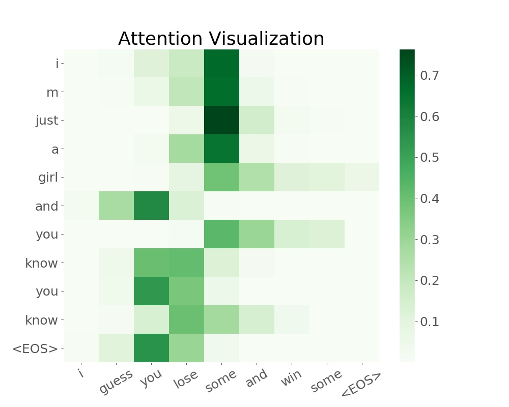
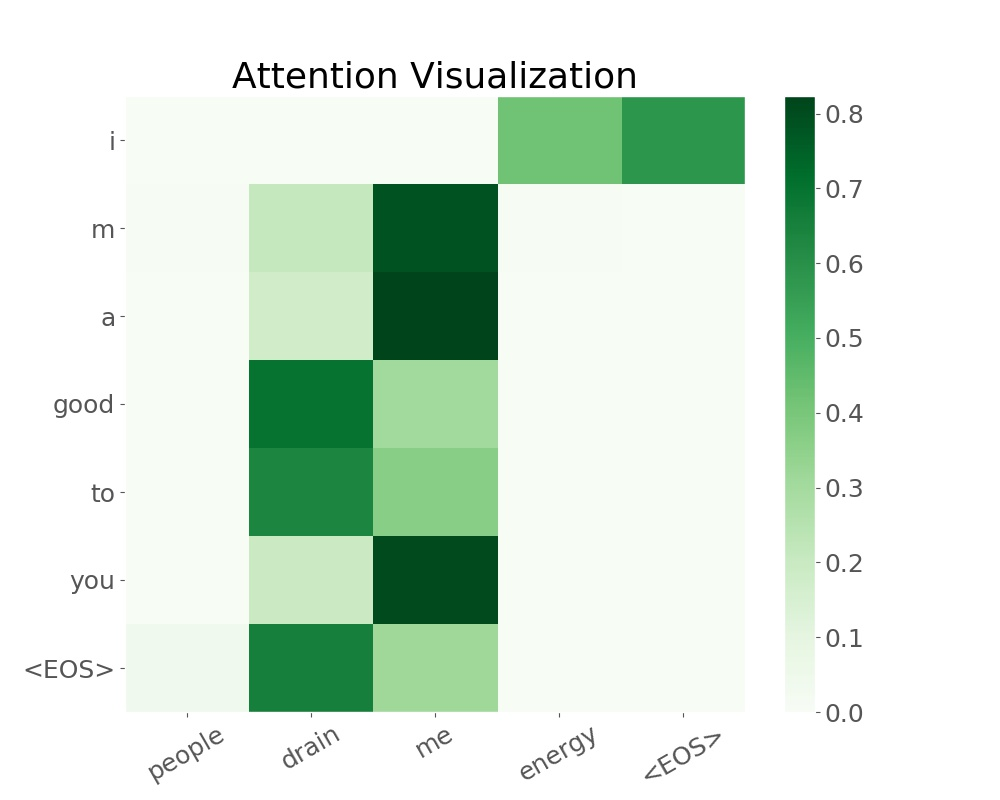

# Lyrics generator using attention mechanism

<!-- vim-markdown-toc GFM -->

* [Introduction](#introduction)
* [Batch data preparation](#batch-data-preparation)
* [Model structure](#model-structure)
* [Evaluation](#evaluation)
* [Concluding remarks and future work](#concluding-remarks-and-future-work)

<!-- vim-markdown-toc -->
## Introduction

Neural network has capability to process complex data such as human languange, images and etc. This is due to its nonliearity nature. Multilayer Perceptron forms vanilla fully-connected neural network. However, it does not fit on data with sequential order. Recurrent network can process sequences as input by utilizing hidden unit in a sequential order. However, RNN with LSTM (or GRU) as basic unit does not hold long term dependencies. It is easy to observe output with repetition pattern from a vanilla RNN. To resolve the issue, one can resort to attention mechanism. Attention mechanism calculates the importances of words in output and input. Therefore, it is a very efficient way to generate output with different contributions from all input. The concept was first referred and clearly stated from [Attention Is All You Need](https://papers.nips.cc/paper/7181-attention-is-all-you-need.pdf). In this project, I focused on how to implement attention mechanism into vanilla seq2seq model.

## Batch data preparation

As the model is quite large, training in a mini-batch fashion could greatly reduce the computation time and acquire more stablized result.

```python
def random_batch(batch_size, lang, pairs, USE_CUDA=True):
	'''
	input -> batch_size
	return -> input/output of a batch, array of lengths of input/output
	batched data -> max_len x batch_size (note that this is required size feeding to gru layer)
	'''
```

## Model structure

Instead of obtaining the strongest impact
from the last input, the importances of all
words are considered. Model "attention"
determines the relative contributions of the
words.

## Evaluation and visualization

### Drake's lyrics generator

Drake one                         | Drake two
:-------------------------:       | :-------------------------:
</img> | </img>

Drake three                       | Drake four
:-------------------------:       | :-------------------------:
</img> | </img>


### Eminem's lyrics generator

Eminem one                        | Eminem two
:-------------------------:       | :-------------------------:
</img> | </img>

Eminem thre                       | Eminem four
:-------------------------:       | :-------------------------:
</img> | </img>


### Michael Jackson's lyrics generator

MJ one                            | MJ two
:-------------------------:       | :-------------------------:
</img> | </img>

MJ three                          | MJ four
:-------------------------:       | :-------------------------:
</img> | </img>

## Concluding remarks and future work

* Conclusions:
    ```
    1. Model is hard to train. This is because the model is still using sequential network.
    2. Pytorch is very flexible and efficient to tweak neural networks.
    3. Optimizing is important in this project. I will try to tweak the model to make it running faster.
    ```
* Future work:
    ```
    1. Tune my current attention implemented model to get better performance.
    2. Add exploitation and exploration function. (This is similar as multi-arm bandit)
    3. Implement a transformer model without using sequential neural network
    4. Do some research on pretrained model in NLP tasks, e.g. BERT.
    ```


## Reference

1. [Distributed Representations of Sentences and Documents](https://arxiv.org/pdf/1405.4053.pdf)
2. [Sequence to Sequence Learning with Neural Networks](https://papers.nips.cc/paper/5346-sequence-to-sequence-learning-with-neural-networks.pdf)
3. [Describing Multimedia Content using Attention-based Encoder-Decoder Networks](https://arxiv.org/pdf/1507.01053.pdf)
4. [Attention Is All You Need](https://papers.nips.cc/paper/7181-attention-is-all-you-need.pdf)
5. [Effective Approaches to Attention-based Neural Machine Translation](https://arxiv.org/pdf/1508.04025.pdf)


## Acknowledgement

* I want to thank Frank, Kayla and Danny for the guidance and support.